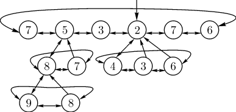

### МИНИСТЕРСТВО НАУКИ И ВЫСШЕГО ОБРАЗОВАНИЯ РОССИЙСКОЙ ФЕДЕРАЦИИ
### Федеральное государственное автономное образовательное учреждение высшего образования
## Дальневосточный федеральный университет
***
### Институт математики и компьютерных технологий
### Департамент информационных и компьютерных систем
### Отчёт о практическом задании по предмету АИСД
# Алгоритм Дейкстры с использованием Фибоначчиевой кучи
***
### Коканов Александр Владиславович, гр. Б9121-09.03.03пикд
### г. Владивосток, 2022

anchortext
# Содержание
[*Содержание*](#содержание) <br/>

[*Глоссарий*](#глоссарий) <br/>

[*Введение*](#введение) <br/>

[*Алгоритм Дейкстры*](#алгоритм-дейкстры) <br/>

[*Фибоначчиева куча*](#фибоначчиева-куча) <br/>

[*Список литературы*](#список-литературы) <br/>

# Глоссарий

<strong id="graph"> Граф</strong> — структура данных, отображающая связи между разными объектами. Состоит из множества вершин и множества соединяющих их рёбер. 

<strong id="vertex"> Вершина</strong> — точка в графе, отдельный объект. Может иметь некоторые характеристики, в частности, число, поставленное в соответствие данной вершине и называемое весом, стоимостью или пропускной способностью вершины.


<strong id="edge"> Ребро</strong> — неупорядоченная пара двух вершин, которые связаны друг с другом. Эти вершины называются концевыми точками или концами ребра. Ребро также может иметь вес.

<strong id="path"> Путь</strong> — последовательность вершин, в которой каждая вершина соединена со следующей ребром. Обычно путь задаётся перечислением вершин, по которым он пролегает.

<strong id="oriented-edge">Ориентированное ребро</strong> — ребро, в котором одну вершину считают началом ребра, а другую — концом.

<strong id="connected-graph">Связный граф</strong> — граф, в котором существует путь между любыми двумия вершинами.

<strong id="weighted-graph">Взвешенный граф</strong> — граф, в котором у каждого ребра и/или каждой вершины есть вес

<strong id="tree">Дерево</strong> — стандартная структура данных, являющаяся связным графом, в котором нет ни одного пути, где начальная и конечная вершина совпадают (цикл). 

<strong id="descendant">Потомок</strong> — вершина, имеющий родительскую вершину.

<strong id="child">Сын</strong> - прямой потомок 

<strong id="parent">Родитель</strong> — вершина, имеющая ребро, соединяющее её с вершиной-потомком.


<strong id="tree-Root">Корень дерева</strong>  — вершина, не имеющая родителя

<strong id="tree-Rank">Ранг дерева</strong> — количество рёбер, исходящих из корня дерева. 

<strong id="array">Массив</strong> - упорядоченный набор элементов, каждый из которых хранит одно значение, идентифицируемое с помощью одного или нескольких индексов.

<strong id="bin-heap">Двоичная (бинарная) куча</strong>  — дерево, в котором выполняется 3 условия: 
1) при этом значение в любой вершине не больше, чем значения её потомков. 
2) у каждой вершины не более двух [*сыновей*](#child) 
3) слои заполняются последовательно сверху вниз и слева направо, без пропусков. 

<strong id="list">Двусвязный циклический линейный список</strong> — стандартная структура данных, состоящая из элементов, содержащих значение и ссылки на следующий и предыдущий элемент списка. При этом начальный элемент содержит ссылку на конечный элемент, и наоборот.

<strong id="asymptotics">Асимптотическая сложность алгоритма</strong> -  время и память, которые понадобятся программе в процессе работы, обычно обозначется с помощью "О большого",  математического способа приблизительной оценки функции. Запись выглядит следующим образом: O(1) - константная сложность (не завясящая от входных данный), O(n), где n - размер структуры данных, - линейная сложность (максимальное количество действий равно n).

<strong id="Indicator">Указатель</strong> — переменная, диапазон значений которой состоит из адресов ячеек памяти или специального значения — нулевого адреса.

# Введение
Во многих ситуациях нам необходимо найти самый оптимальный [путь](#path) между какими-либо двумя точками. Однако помимо этого, при больших входных данных, нам нужно уметь делать это как можно быстрее. 

## Применение
1) Картографические сервисы. 
Алгоритмы нахождения кратчайшего [*пути*](#path) на [*графе*](#graph) применяются для нахождения путей между физическими объектами на таких картографических сервисах, как карты Google или OpenStreetMap.
2) Маршрутизация движения данных в компьютерной сети. 
3) Расчет движения тока по электрическим цепям.
4) Поиск системой бронирования наиболее быстрых или дешевых билетов, в том числе с возможными пересадками;
5) Разработка поведения неигровых персонажей, создание игрового ИИ в разработке игр. 
6) Недетерминированная машина
Если представить недетерминированную абстрактную машину как граф, где [*вершины*](#vertex) описывают состояния, а ребра определяют возможные переходы, тогда алгоритмы поиска кратчайшего пути могут быть применены для поиска оптимальной последовательности решений для достижения главной цели. Например, если вершинами являются состояния Кубика Рубика, а ребром представляет собой одно действие над кубиком, тогда алгоритм может быть применён для поиска решения с минимальным количеством ходов.

## Авторство

Структура данных Фибоначчиева куча была разработана Майклом Фредманом и Робертом Тарьяном  в 1984 году и опубликована ими в научном журнале в 1987 году. Была создана при работе по улучшению [*асимптотической сложности*](#asymptotics) алгоритма Дейкстры -  алгоритм на графах, находящий кратчайшие пути от одной из вершин графа до всех остальных.

## Варианты реализации алгоритма Дейкстры
Существует несколько основных способов реализации алгоритма Декстры, каждый из которых отличается временной сложностью: 
* Наивная реализация 
* Использование [*бинарной кучи*](#bin-heap) 
* Использование [*фибоначчиевой кучи*](#фибоначчиева-куча)

Сложность алгоритма Дейкстры складывается из двух основных операций: время нахождения [*вершины*](#vertex) $v$ с наименьшей величиной расстояния до начальной вершины и время уменьшения значения вершины.

1) ___Наивная реализация___ 
При простейшей реализации рассматривается всё множество вершин, а для хранения велечин расстояний используется [*массив*](#array). Основные операции потребуют соответственно O($n$) и O(1) времени,  где $n$ - количество вершин. Первая операция всего выполняется $n$ раз, а вторая — $m$, где $m$ - количество [*рёбер*](#edge). Таким образом, получаем асимптотику простейшей реализации алгоритма Дейкстры: O($n^2$ + $m$). 
<br/>
2) ___Использование бинарной кучи___
Для разреженных [*графов*](#graph) (то есть таких, для которых m много меньше n²) непосещённые вершины можно хранить в двоичной куче, тогда время получения вершины с минимальным расстоянием до начальной вершины  станет $log(n)$ при том, и время уменьшения значения вершины возростёт до $log(n)$. Таким образом, мы получим общее время работы алгоритма O($n$ * $log(n)$ + $m$ * $log(n)$) = O($m$ * $log(n)$).
<br/>
3) ___Использование фибоначчиевой кучи___
Если для хранения непосещённых вершин использовать фибоначчиеву кучу, для которой удаление происходит в среднем за O($log(n)$), а уменьшение значения в среднем за  O(1), то время работы алгоритма составит O($n$ * $log(n)$ + $m$).

В итоге получаем следующий резальтат:

|                    | Поиск Минимума | Изменение значения | Общее                   |
|--------------------|----------------|--------------------|-------------------------|
| Наивная реализация | O($n$)         | O(1)               | O($n^2$ + $m$           |
| Двоичная куча      | O($log(n)$)    | O($log(n)$)        | O($m$ * $log(n)$)       |
| Фибоначчиева куча  | O($log(n)$)    | O(1)               | O($n$ * $log(n)$ + $m$) |


Таким образом, алгоритм Дейкстры и использованием кучи Фибоначчи является наиболее быстрым с точки хрения [*асимптотики*](#asymptotics).

# Алгоритм Дейкстры
Данный алгоритм является алгоритмом на [*графах*](#graph), изобретённым нидерландским учёным Эдсгером Дейкстрой в 1959 году. Он находит кратчайшие [*пути*](#path) от одной из [*вершины*](#vertex) графа до всех остальных вершин.

#### Описание алгоритма   
Каждой вершине из V сопоставим метку — минимальное известное расстояние от этой вершины до a.

Алгоритм работает пошагово — на каждом шаге он «посещает» одну вершину и пытается уменьшать метки.

Работа алгоритма завершается, когда все вершины посещены.

Инициализация:
- Метка самой вершины a инициализируется 0.
- Метки остальных вершин инициализируются бесконечносями. Это отражает то, что расстояния от a до других вершин пока неизвестны
- Все вершины графа помечаются как не посещённые.

Шаг алгоритма:
- Если все вершины посещены, алгоритм завершается.
- В противном случае, из ещё не посещённых вершин выбирается вершина u, имеющая минимальную метку.

- Мы рассматриваем всевозможные маршруты, в которых u является предпоследним пунктом. Вершины, в которые ведут рёбра из u, назовём соседями этой вершины. Для каждого соседа вершины u, кроме отмеченных как посещённые, рассмотрим новую длину пути, равную сумме значений текущей метки u и длины ребра, соединяющего u с этим соседом.
- Если полученное значение длины меньше значения метки соседа, заменим значение метки полученным значением длины. Рассмотрев всех соседей, пометим вершину u как посещённую и повторим шаг алгоритма.


Результатом алгоритма является список кратчаших маршрутов от исходной точки до всех остальных

<p align="center"></p>
<p align="center"> Демонстрация алгоритма Дейкстры </p>


Для большего понимания работы алгоритма Дейкстры можно воспользоваться [визуализатором алгоритма Дейкстры](https://www.cs.usfca.edu/~galles/visualization/Dijkstra.html)
# Фибоначчиева куча

___Фибоначчиева куча___ — стандартная структура данных, представляющая их себя набор [*деревьев*](#tree), каждое из которых имеет не менее F(n + 2) элементов, где F(i) – i - ое число фибоначчи, а n –  [*ранг*](#tree-Rank) дерева. При этом в каждом дереве можно удалить не более одного элемента. [*Корни*](#tree-Root) деревьев объединены в [*двусвязный циклический линейный список*](#list). Основными операциями фибонччиевой кучи являются: вставка нового элемента, получение значения минимального элемента, удаление минимального элемента, уменьшение значения элемента, соединение двух куч.

Фибоначчиева куча хранит в себе [*указатель*](#Indicator) на минимальный узел и, при необходимости, размер.

Сам узел хранит в себе следующие данные: 
1) ключ – значение, с помощью которого можно идентифицировать узел.
2) значение элемента
3) указатель на родительский узел
4) указатель на дочерний узел  
5) указатель на левый узел
6) указатель на правый узел
7) ранг дерева, корнем которого является данный узел
8) метка о том, был ли удален в процессе изменения ключа ребенок этой вершины
<br>


<p align="center"></p>
<p align="center"> Пример Фибоначчиевой кучи</p>


#### Операции, поддерживаемые Фибоначчиевой кучей
- ___Вставка элемента___ 
Вставка элемента, как и большинство операций, происходит довольно просто. Необходимо создать новый элемент и связать его с корневым [*списком*](#list) кучи. Другими словами, при создании нового элемента мы просто создаём фибонначиево дерево с одной [*вершиной*](#vertex) или же с нулевым рангом. Также после этого необходимо сравнить значения нового элемента и минимума, и если новый элемент меньше, то заменить минимум.

``` c++
Node *Insert(int value, int key) {
        Node *new_elem = MakeNode(value, key); // создание нового эдемента
        min = Merge(min, new_elem); // слияние нового элемента с корневым списком 
        return new_elem;
    }
```

- ___Получение минимума___ 
Так как мы храним указатель на узел с минимальным значением, нам необходимо просто вернуть сответствующий узел.

``` c++
Node* GetMin() {
        return min;
    }
```

- ___Слияние с другой кучей___
Слияние двух куч представляет собой, по сути, добавление корня первой кучи в список [*детей*](#child) второй кучи. Таким образом, одна из куч становится подкучей второй. Важно отметить, что главной всегда остаётся куча с наименьшим минимумом. Так что если вдруг у нашей кучи минимум больше, чем у новой, нужно либо перед слиянием поменять кучи местами, либо после слияния поменять указатель на минимум.

``` c++
 Node* Merge(Node *first, Node *second) {
        if (first == nullptr) 
            return second;
        if (second == nullptr) 
            return first;
        if (first->key > second->key)
            swap(first, second);
        Node *A = first->left;
        Node *B = second->left;
        A->right = second;
        second->left = A;
        first->left = B;
        B->right = first;
        return first;
    }
```

- ___Уменьшение элемента___ 
При уменьшении элемента нам необходимо проверить,стал ли наш элемент меньше своего [*родителя*](#parent). Если такое всё-таки произошло, мы отрезаем элемент от кучи и связываем его с корневым списком. Однано, может произойти так, что после наших действий у родителя нашего элемента было удалено 2 ребёнка, что недопустимо. В таком случае нам необходимо выполнить так называемое "каскадное вырезание". Начиная с родителя нашего элемента, мы проверяем, был ли он помечен. Если да, то вырезаем его, снимаем метку и повторяем все действия с его родителем (с родителем родителя исходного элемента). Продолжаем до тех пор, пока не найдём элемент без "пометки" или пока не дойдём до корня дерева. 

``` c++
Node* DecreaseKey(Node *heap, Node *elem, int key) {
        if (elem->key < key) // проверяем, меньше ли новое значение
            return heap;
        elem->key = key;
        if (elem->parent != nullptr) {
            if (elem->key < elem->parent->key) {
                heap = Cut(heap, elem); // вырезаем элемент
                Node* parent = elem->parent;
                elem->parent = nullptr;
                CascadingCut(parent); // производим каскадное вырезание
                if (parent != nullptr && parent->parent != nullptr)
                    parent->mark = true;
            }
        }
        else if (elem->key < heap->key) 
                heap = elem;
        return heap;
    }
```
- ___Удаление минимума___ 
Удаление минимума является самой долгой операцией, так как именно при её выполнении мы приводим нашу кучу в порядок, а именно «прореживаем» деревья. Сначала мы отрезаем наш минимум от корневого списка, а всех его детей отправляем в корневой список. После этого мы проходимся по всем корням и попарно соединяем деревьев с равным рангом. То есть, если у нас есть два дерева ранга k, то мы их сливаем и получаем одно дерево ранга k + 1. Параллельно с этим мы ищем минимум среди корней. После выполнения данной операции у нас не будет два дерева с одинаковым рангом, а общее количество деревьев будет равно log(n), где n – количество вершин. 

```c++
Node* RemoveMinimum(Node* heap) {
        UnMarkAll(heap->child);
        if (heap->right == heap)
            heap = heap->child;
        // отрезаем минимум от корневого списка, а всех его детей отправляем в корневой список
        else { 
            heap->right->left = heap->left;
            heap->left->right = heap->right;
            heap = Merge(heap->right, heap->child);
        }
        if (heap == nullptr)
            return heap;
        heap = Consolidate(heap); // «прореживаем» деревья

        Node* min = heap;
        Node* start = heap;
        do {
            if (heap->key < min->key)
                min = heap;
            heap = heap->right;
        } while (heap != start);
        return min;
    }
```

Для большего понимания работы Фибонначчиевой кучи можно воспользоваться [визуализатором Фибоначчиевой кучи](https://www.cs.usfca.edu/~galles/visualization/FibonacciHeap.html)


# Список литературы

1. https://wiki5.ru/wiki/Fibonacci_heap#Implementation_of_operations 
2. https://neerc.ifmo.ru/wiki/index.php?title=%D0%A4%D0%B8%D0%B1%D0%BE%D0%BD%D0%B0%D1%87%D1%87%D0%B8%D0%B5%D0%B2%D0%B0_%D0%BA%D1%83%D1%87%D0%B0
3. https://ru.wikipedia.org/wiki/%D0%A4%D0%B8%D0%B1%D0%BE%D0%BD%D0%B0%D1%87%D1%87%D0%B8%D0%B5%D0%B2%D0%B0_%D0%BA%D1%83%D1%87%D0%B0
4. http://cppalgo.blogspot.com/2011/11/fibonacci-heap.html
5. https://ru.wikipedia.org/wiki/%D0%90%D0%BB%D0%B3%D0%BE%D1%80%D0%B8%D1%82%D0%BC_%D0%94%D0%B5%D0%B9%D0%BA%D1%81%D1%82%D1%80%D1%8B
6. https://habr.com/ru/post/111361/
7. http://acm.math.spbu.ru/~sk1/mm/au-download/conspect/conspect.pdf
8. https://prog-cpp.ru/deikstra/
9. https://www.cs.princeton.edu/~wayne/teaching/fibonacci-heap.pdf 
10. https://vies.wiki/wiki/ru/Fibonacci_heap
11.	https://youtu.be/CeAjTL-Fshs
12.	http://acm.math.spbu.ru/~sk1/mm/au-download/14f-conspect/2014-10-21-Fib.pdf
13. https://wiki5.ru/wiki/Potential_method
14.	https://kbaile03.github.io/projects/fibo_dijk/fibo_dijk.html	
15.	http://www-m3.ma.tum.de/foswiki/pub/MN0506/WebHome/dijkstra.pdf
16.	http://staff.ustc.edu.cn/~csli/graduate/algorithms/book6/chap21.htm
17.	https://infopedia.su/17xb2c6.html
18.	https://e-maxx.ru/algo/dijkstra
19.	https://www.programiz.com/dsa/fibonacci-heap
20.	https://www.geeksforgeeks.org/fibonacci-heap-insertion-and-union/
21.	https://ask-dev.ru/info/101216/what-is-the-intuition-behind-the-fibonacci-heap-data-structure
22.	https://maryrosecook.com/blog/post/the-fibonacci-heap-ruins-my-life
23.	https://cse.sc.edu/~mgv/csce580f08/gradPres/boccanfusoMcKenzie080910.ppt
24.	https://www.cs.auckland.ac.nz/software/AlgAnim/dijkstra.html#dijkstra_anim
25.	https://web.stanford.edu/class/archive/cs/cs166/cs166.1146/lectures/07/Small07.pdf
26.	https://blog.skillfactory.ru/glossary/algoritm-dejkstry/ 
27.	http://www.science.vsu.ru/dissertations/9717/%D0%94%D0%B8%D1%81%D1%81%D0%B5%D1%80%D1%82%D0%B0%D1%86%D0%B8%D1%8F_%D0%9F%D0%BE%D1%82%D0%B0%D0%BF%D0%BE%D0%B2_%D0%94.%D0%A0..pdf

<!-- 
Алгоритм Дейкстры в сочетании с Фибоначчиевой кучей, в теории, является практически самым быстрым алгоритмом для поиска кратчайшего пути в графе. -->